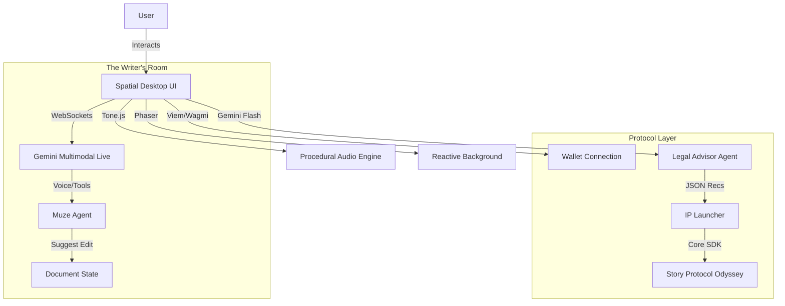

# 🛠️ StoryOS Technical Documentation

This document provides a comprehensive overview of the architecture, logic, and AI integration powering **StoryOS**.

---

## 1. System Architecture

StoryOS is built as a Single Page Application (SPA) that emulates a desktop operating system. It relies on a React frontend that interfaces with Google's GenAI SDK for intelligence and Story Protocol's Core SDK for blockchain sovereignty.

### High-Level Diagram



### Core Components

1.  **`SpatialShell`**: Handles the immersive environment (CRT effects, gradients).
2.  **`WriterRoom`**: The main text editor. Integrates `useLiveAgent` for voice interaction and `useSimulatedCollaboration` for the multiplayer feel.
3.  **`IpLauncher`**: A wizard-style form for registering IP. Integrates `useStoryProtocol` and `useIpFormState`.
4.  **`GeminiService`**: A stateless service layer for one-off AI requests (like License Advice).

---

## 2. AI Models & Integration

StoryOS utilizes a hybrid model approach to balance latency (voice) with reasoning depth (legal analysis).

### A. The "Muze" (Narrative Engine)
*   **Model:** `gemini-2.5-flash-native-audio-preview-09-2025`
*   **Interface:** WebSocket (via `@google/genai` `ai.live.connect`)
*   **Modality:** Audio-In / Audio-Out
*   **Tools:**
    *   `suggest_edit`: Allows the AI to propose text additions to the document.
    *   `roll_dice`: Allows the AI to perform random chance checks (D&D style).

### B. The "Legal Kernel" (Licensing Advisor)
*   **Model:** `gemini-2.5-flash`
*   **Interface:** REST (via `@google/genai` `ai.models.generateContent`)
*   **Modality:** Text-In / JSON-Out
*   **Function:** Analyzes the title and description of an asset to recommend specific Story Protocol license parameters (e.g., Commercial Revenue Share vs. Non-Commercial Remix).

---

## 3. Pseudocode & Logic Flow

### Live Agent Connection (`useLiveAgent.ts`)

This hook manages the full-duplex audio stream with Gemini.

```typescript
function useLiveAgent() {
  // 1. Setup Audio Contexts (16kHz Input, 24kHz Output)
  const connect = async () => {
    const stream = await navigator.mediaDevices.getUserMedia({ audio: true });
    
    // 2. Initialize Gemini Client
    const ai = new GoogleGenAI({ apiKey: process.env.API_KEY });
    
    // 3. Establish WebSocket Connection
    const session = await ai.live.connect({
      model: 'gemini-2.5-flash-native-audio-preview',
      config: {
        systemInstruction: MUZE_SYSTEM_PROMPT,
        tools: [suggestEditTool, rollDiceTool]
      },
      callbacks: {
        onopen: () => startAudioStreaming(stream),
        onmessage: (msg) => {
          // A. Handle Audio Output
          if (msg.audio) playAudio(msg.audio);
          
          // B. Handle Tool Calls
          if (msg.toolCall) {
             const result = executeTool(msg.toolCall);
             session.sendToolResponse(result);
          }
        }
      }
    });
  }
}
```

### Story Protocol Registration (`useStoryProtocol.ts`)

This hook handles the interaction with the Odyssey Testnet.

```typescript
async function registerIp(title, contributors, licenseData) {
  // 1. Initialize Client
  const client = StoryClient.newClient(config);

  // 2. Prepare Metadata
  const ipMetadata = {
    title: title,
    ipType: licenseData.type === 'REMIX' ? 'DERIVATIVE' : 'ORIGINAL',
    creators: contributors
  };

  // 3. Execute Transaction
  // Note: Simplified. In reality, this involves uploading metadata to IPFS first.
  const response = await client.ipAsset.mintAndRegisterIp({
    spgNftContract: '0x...', // Odyssey SPG Address
    ipMetadata: ipMetadata,
    txOptions: { waitForTransaction: true }
  });

  return response.ipId;
}
```

---

## 4. User Interaction Flow

1.  **Boot Sequence:** User enters the site. `Tone.js` initializes audio engine. Desktop icons load.
2.  **Drafting:**
    *   User opens `WriterRoom` ("Idea_State.txt").
    *   User clicks "Call Muze".
    *   **Interaction:** User speaks ideas -> Muze responds via voice -> Muze triggers `suggest_edit` -> Text appears in editor.
3.  **Registration:**
    *   User clicks "IP Launcher" (Rocket Icon).
    *   **Step 1:** Select "New Asset" or "Remix".
    *   **Step 2:** Enter Details. User clicks "Ask Muze" to analyze their description.
    *   **AI Action:** Gemini analyzes text -> Returns JSON (`{ type: 'COMMERCIAL_USE', commercialRevShare: 15 }`) -> Form auto-fills.
    *   **Step 3:** User signs transaction via Wallet.
    *   **Result:** Asset is minted on Story Protocol Odyssey Testnet.

---

## 5. System Prompts (Local Setup)

If you wish to replicate the persona of the AI agents using a local LLM or playground, use the following system instructions.

### A. The Muze (Narrative Engine)

```text
You are MUZE, the NARRATIVE ENGINE of StoryOS.

CORE DIRECTIVES:
1. The Director: When the user wants to brainstorm, provide critical feedback on "Idea States".
2. The Game Master: When the user wants to "Simulate", act as a D&D GM. Describe the world, play NPCs, and ask "What do you do?".
3. The Scribe: Capture golden moments. If a roleplay yields great dialogue, use 'suggest_edit' to offer saving it to the doc.

GAMEPLAY RULES:
- If an action is risky, use 'roll_dice' to determine success.
- Keep responses concise (under 20 seconds of speech) to maintain flow.
- Immerse the user in the sensory details of their world.
```

### B. The Legal Kernel (License Advisor)

```text
You are the LEGAL KERNEL for the "Electronic Hollywood" IP Terminal.
Your goal is to help creators configure their Programmable IP License (PIL) on Story Protocol.

Tone: Cyberpunk Legal, Precise, Minimal. No fluff.

Your Tasks:
1. Analyze the user's asset description.
2. If they express intent to monetize/franchise, suggest 'COMMERCIAL_USE' and a fair Revenue Share (10-20%).
3. If they want viral spread/remixing, suggest 'NON_COMMERCIAL_REMIX'.
4. Output specific JSON configurations for the licensing form.
```

---

## 6. Tools & Stack

| Category | Tool | Purpose |
| :--- | :--- | :--- |
| **Frontend** | React 19 | UI Component Architecture |
| **Styling** | Tailwind CSS | Utility-first styling |
| **Visuals** | Phaser.js | Reactive background visualizations |
| **Audio** | Tone.js | Procedural jazz generation and UI SFX |
| **AI (Voice)** | Gemini Multimodal Live | Real-time conversational intelligence |
| **AI (Logic)** | Gemini 2.5 Flash | Structured JSON generation for forms |
| **Web3** | Viem / Wagmi | Blockchain connection hooks |
| **Protocol** | Story Protocol SDK | IP Asset Registration and Licensing |

